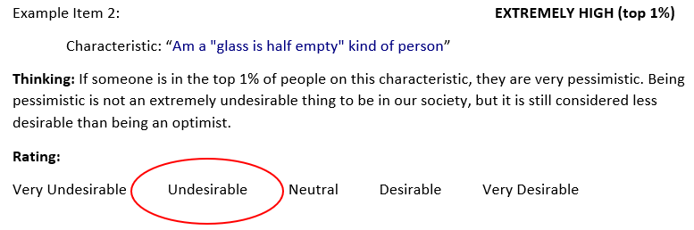
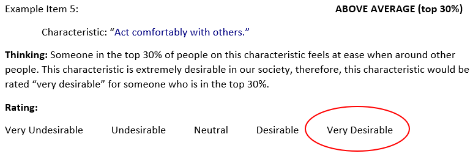
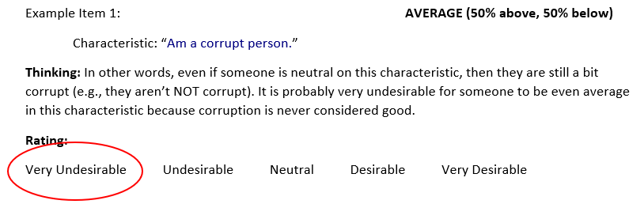
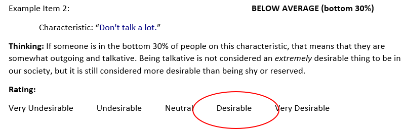
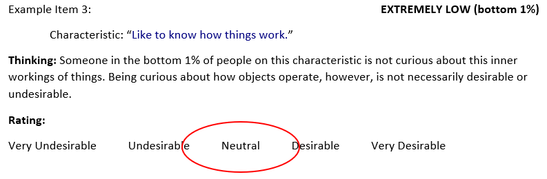

```{css}

.lowercase {
  text-decoration: underline !important;
}

.shiny-input-radiogroup {
  display: flex;
  justify-content: space-between;
  width: 80%;
  margin: 20px auto;
}
input[type="radio"] {
  margin: 0 10px;
}
input[type="radio"]:checked + label {
  font-weight: bold;
  color: red; /* Highlight selected option */
}

/*cell-output-display shiny-options-group*/

```

```{r}
## Creating a "second attempt" latency survey using the 11 Study 1 categories (although some categories will be "grouped"): Linear, hooked, non-mono, hooked(n), Linear(n)

library(surveydown)


##surveydown objects

##grab raw data numbers and key numbers from new categorization
##remove i and _ numbers from the raw data
##put key categorization as unlist tall data - will need to do the same for the other data
##join them on number, then put back into a wide dataset and create objects for each of the categories 

#install.packages("reshape2")
library(reshape2)
library(dplyr)

#grabbing item number and text
items <- read.csv("300itemstems.csv")

##grabbing categorizations
cat <- read.csv("KuncelTellegen Q Sort Items - Sheet1.csv")

##renaming categorizations
names <- c("Plinear", "PEhook", "PMhook", "PS", "Ohook", "X", "witch", "uncat", "flat", "X1", "Nhook", "Nzshape", "NEhook", "Nlinear")
colnames(cat) <- names

rm(names)

##create 2 column dataset
test <- melt(cat)

##remove X columns
test <- test[,3:4]

##remove NAs in column value
test <- as.data.frame(na.omit(test))

##rename value to Itemnum
colnames(test) <- c("category","Itemnum")

##join values on Itemnum from items and value from cat
Merged <- merge(x = items, y = test, by = "Itemnum", all = TRUE)

rm(cat,test,items)

##Create objects based on items
PosLinear <- Merged %>%
  filter(category == "Plinear" | category == "PS")

PosHook <- Merged %>%
  filter(category == "PEhook" | category == "PMhook")

OPhook <- Merged %>%
  filter(category == "Ohook")

Witch <- Merged %>%
  filter(category == "witch")

Flat <- Merged %>%
  filter(category == "flat")

NegLinear <- Merged %>%
  filter(category == "Nlinear" | category == "Nzshape")

NegHook <- Merged %>%
  filter(category == "NEhook" | category == "Nhook")

```

::: {#welcome .sd-page}

# Welcome to our survey!

We want you to rate **how desirable** is it to be for someone to be, in our culture,

+ extremely high (top 1% of all people)... 
+ above average (top 30% of all people)...
+ neutral (e.g., completely average)... 
+ below average (bottom 30% of all people)..., and
+ extremely low (bottom 1% of all people)...  

...on a number of different characteristics.

Below we provide some examples of how we would like you to think and respond to “how valued” a person would be viewed by our culture, if they were deemed top 1%, top 30%, average, bottom 30% or bottom 1% for different characteristics:

## **TOP 1%:**

This means that very, very few people are “higher” than the person along the characteristic. 



## **TOP 30%:**

This means that about a third of people are “higher” than the person along the characteristic. 



## **AVERAGE:**

This means that the person is perfectly “in the middle” along the characteristic (50% of people have “more” of the characteristic and 50% have “less). 



## **BOTTOM 30%:**

This means that about a third of people are “lower” than the person along the characteristic. 



## **BOTTOM 1%:**

This means that very, very few people are “lower” than the person along the characteristic. 



We will be recording *how long it takes for you to respond*, so please respond as quickly but accurately as possible. The next few pages will be *practice* exercises to let you become familiar with the rating procedure -- we will let you know when the practice ends and the actual data collection begins. 

```{r}
sd_next("practice")
```

:::

::: {#practice .sd-page}

The task we're asking you to do is unfamiliar to most people. Therefore, before we begin with the **actual** experiment, you will have the chance to *practice* with two items -- you will have an opportunity to ask the experimenter questions as you respond to the practice questions. 

The first item that you will be asked to provide ratings for is: 

**Readily overcome setbacks.**

Please hit the `"Next"` button when you are ready to begin the practice session.

```{r}
sd_next()
```

::: 

::: {#practice1 .sd-page}

<script>
  document.addEventListener("DOMContentLoaded", function() {
    let neutralOption = document.querySelector('input[value="Neutral"]');
    if (neutralOption) {
      neutralOption.checked = true; // Pre-select Neutral
    }
  });
</script>

The item that you will be asked to provide ratings for is: 
**Readily overcome setbacks.**


```{r}
# https://x.com/i/grok/share/1DcUBUJovlpHmIbykgnGC6uGO

sd_question(
  type  = 'mc',
  id    = 'prac1_EH',
  label = "How desirable is it to be **Extremely High** in this characteristic? (top 1%)",
  option = c(
    'Very Undesirable'    = '1',
    'Undesirable'       = '2',
    'Neutral'           = '3',
    'Desirable'         = '4',
    'Very Desirable'    = '5'
  ))

sd_next(next_page = 'end')
```

**Readily overcome setbacks.**

[testing]{.underline}

```{r}
sd_question(
  type  = 'mc',
  id    = 'prac1_AA',
  label = "How desirable is it to be **Above Average** in this characteristic? (top 30%)",
  option = c(
    'Very Undesirable'    = '1',
    'Undesirable'       = '2',
    'Neutral'           = '3',
    'Desirable'         = '4',
    'Very Desirable'    = '5'
  ))

sd_next(next_page = 'end')
```

**Readily overcome setbacks.**


```{r}
sd_question(
  type  = 'mc',
  id    = 'prac1_A',
  label = "How desirable is it to be **Average** in this characteristic?",
  option = c(
    'Very Undesirable'    = '1',
    'Undesirable'       = '2',
    'Neutral'           = '3',
    'Desirable'         = '4',
    'Very Desirable'    = '5'
  ))

sd_next(next_page = 'end')
```

**Readily overcome setbacks.**


```{r}
sd_question(
  type  = 'mc',
  id    = 'prac1_BA',
  label = "How desirable is it to be **Below Average** in this characteristic? (bottom 30%)",
  option = c(
    'Very Undesirable'    = '1',
    'Undesirable'       = '2',
    'Neutral'           = '3',
    'Desirable'         = '4',
    'Very Desirable'    = '5'
  ))

sd_next(next_page = 'end')
```

**Readily overcome setbacks.**


```{r}
sd_question(
  type  = 'mc',
  id    = 'prac1_EL',
  label = "How desirable is it to be **Extremely Low** in this characteristic? (bottom 1%)",
  option = c(
    'Very Undesirable'    = '1',
    'Undesirable'       = '2',
    'Neutral'           = '3',
    'Desirable'         = '4',
    'Very Desirable'    = '5'
  ))

sd_next(next_page = 'end')

```


::: 

::: {#practice2 .sd-page}

The item that you will be asked to provide ratings for is: 
**Postpone decisions.**


```{r}
sd_question(
  type  = 'mc',
  id    = 'prac1_EH',
  label = "How desirable is it to be **Extremely High** in this characteristic? (top 1%)",
  option = c(
    'Very Undesirable'    = '1',
    'Undesirable'       = '2',
    'Neutral'           = '3',
    'Desirable'         = '4',
    'Very Desirable'    = '5'
  ))

sd_next(next_page = 'end')
```

**Postpone decisions.**


```{r}
sd_question(
  type  = 'mc',
  id    = 'prac1_AA',
  label = "How desirable is it to be **Above Average** in this characteristic? (top 30%)",
  option = c(
    'Very Undesirable'    = '1',
    'Undesirable'       = '2',
    'Neutral'           = '3',
    'Desirable'         = '4',
    'Very Desirable'    = '5'
  ))

sd_next(next_page = 'end')
```

**Postpone decisions.**


```{r}
sd_question(
  type  = 'mc',
  id    = 'prac1_A',
  label = "How desirable is it to be **Average** in this characteristic?",
  option = c(
    'Very Undesirable'    = '1',
    'Undesirable'       = '2',
    'Neutral'           = '3',
    'Desirable'         = '4',
    'Very Desirable'    = '5'
  ))

sd_next(next_page = 'end')
```

**Postpone decisions.**


```{r}
sd_question(
  type  = 'mc',
  id    = 'prac1_BA',
  label = "How desirable is it to be **Below Average** in this characteristic? (bottom 30%)",
  option = c(
    'Very Undesirable'    = '1',
    'Undesirable'       = '2',
    'Neutral'           = '3',
    'Desirable'         = '4',
    'Very Desirable'    = '5'
  ))

sd_next(next_page = 'end')
```

**Postpone decisions.**


```{r}
sd_question(
  type  = 'mc',
  id    = 'prac1_EL',
  label = "How desirable is it to be **Extremely Low** in this characteristic? (bottom 1%)",
  option = c(
    'Very Undesirable'    = '1',
    'Undesirable'       = '2',
    'Neutral'           = '3',
    'Desirable'         = '4',
    'Very Desirable'    = '5'
  ))

sd_next(next_page = 'end')

```


::: 


::: {#PositiveLinear1 .sd-page}


The item that you will be asked to provide ratings for is: 

```{r}
library(dplyr)
PSitem1 <- subset(slice_sample(PosLinear,n=1), select = "Text")
PosLinear <- PosLinear %>% filter(Text != PSitem1$Text)
```

```{r}
cat(paste(PSitem1$Text))

sd_question(
  type  = 'mc',
  id    = 'poslinear_1EH',
  label = "How desirable is it to be **Extremely High** in this characteristic? (top 1%)",
  option = c(
    'Very Undesirable'    = '1',
    'Undesirable'       = '2',
    'Neutral'           = '3',
    'Desirable'         = '4',
    'Very Desirable'    = '5'
  ))

sd_next(next_page = 'end')
```


```{r}
cat(paste(PSitem1$Text))

sd_question(
  type  = 'mc',
  id    = 'poslinear_1AA',
  label = "How desirable is it to be **Above Average** in this characteristic? (top 30%)",
  option = c(
    'Very Undesirable'    = '1',
    'Undesirable'       = '2',
    'Neutral'           = '3',
    'Desirable'         = '4',
    'Very Desirable'    = '5'
  ))

sd_next(next_page = 'end')
```

```{r}
cat(paste(PSitem1$Text))

sd_question(
  type  = 'mc',
  id    = 'poslinear_1A',
  label = "How desirable is it to be **Average** in this characteristic?",
  option = c(
    'Very Undesirable'    = '1',
    'Undesirable'       = '2',
    'Neutral'           = '3',
    'Desirable'         = '4',
    'Very Desirable'    = '5'
  ))

sd_next(next_page = 'end')
```

```{r}
cat(paste(PSitem1$Text))

sd_question(
  type  = 'mc',
  id    = 'poslinear_1BA',
  label = "How desirable is it to be **Below Average** in this characteristic? (bottom 30%)",
  option = c(
    'Very Undesirable'    = '1',
    'Undesirable'       = '2',
    'Neutral'           = '3',
    'Desirable'         = '4',
    'Very Desirable'    = '5'
  ))

sd_next(next_page = 'end')
```

```{r}
cat(paste(PSitem1$Text))

sd_question(
  type  = 'mc',
  id    = 'poslinear_1EL',
  label = "How desirable is it to be **Extremely Low** in this characteristic? (bottom 1%)",
  option = c(
    'Very Undesirable'    = '1',
    'Undesirable'       = '2',
    'Neutral'           = '3',
    'Desirable'         = '4',
    'Very Desirable'    = '5'
  ))

sd_next(next_page = 'end')
```

::: 


::: {#PositiveLinear2 .sd-page}

The item that you will be asked to provide ratings for is: 

```{r}
library(dplyr)
PSitem2 <- subset(slice_sample(PosLinear,n=1), select = "Text")
PosLinear <- PosLinear %>% filter(Text != PSitem2$Text)
```

```{r}
cat(paste(PSitem2$Text))

sd_question(
  type  = 'mc',
  id    = 'poslinear_2EH',
  label = "How desirable is it to be **Extremely High** in this characteristic? (top 1%)",
  option = c(
    'Very Undesirable'    = '1',
    'Undesirable'       = '2',
    'Neutral'           = '3',
    'Desirable'         = '4',
    'Very Desirable'    = '5'
  ))

sd_next(next_page = 'end')
```


```{r}
cat(paste(PSitem2$Text))

sd_question(
  type  = 'mc',
  id    = 'poslinear_2AA',
  label = "How desirable is it to be **Above Average** in this characteristic? (top 30%)",
  option = c(
    'Very Undesirable'    = '1',
    'Undesirable'       = '2',
    'Neutral'           = '3',
    'Desirable'         = '4',
    'Very Desirable'    = '5'
  ))

sd_next(next_page = 'end')
```

```{r}
cat(paste(PSitem2$Text))

sd_question(
  type  = 'mc',
  id    = 'poslinear_2A',
  label = "How desirable is it to be **Average** in this characteristic?",
  option = c(
    'Very Undesirable'    = '1',
    'Undesirable'       = '2',
    'Neutral'           = '3',
    'Desirable'         = '4',
    'Very Desirable'    = '5'
  ))

sd_next(next_page = 'end')
```

```{r}
cat(paste(PSitem2$Text))

sd_question(
  type  = 'mc',
  id    = 'poslinear_2BA',
  label = "How desirable is it to be **Below Average** in this characteristic? (bottom 30%)",
  option = c(
    'Very Undesirable'    = '1',
    'Undesirable'       = '2',
    'Neutral'           = '3',
    'Desirable'         = '4',
    'Very Desirable'    = '5'
  ))

sd_next(next_page = 'end')
```

```{r}
cat(paste(PSitem2$Text))

sd_question(
  type  = 'mc',
  id    = 'poslinear_2EL',
  label = "How desirable is it to be **Extremely Low** in this characteristic? (bottom 1%)",
  option = c(
    'Very Undesirable'    = '1',
    'Undesirable'       = '2',
    'Neutral'           = '3',
    'Desirable'         = '4',
    'Very Desirable'    = '5'
  ))

sd_next(next_page = 'end')
```

::: 


::: {#Witch1.sd-page}

The item that you will be asked to provide ratings for is: 

```{r}
library(dplyr)
Witem1 <- subset(slice_sample(Witch,n=1), select = "Text")
Witch <- Witch %>% filter(Text != Witem1$Text)
```

```{r}
cat(paste(Witem1$Text))

sd_question(
  type  = 'mc',
  id    = 'witch_1EH',
  label = "How desirable is it to be **Extremely High** in this characteristic? (top 1%)",
  option = c(
    'Very Undesirable'    = '1',
    'Undesirable'       = '2',
    'Neutral'           = '3',
    'Desirable'         = '4',
    'Very Desirable'    = '5'
  ))

sd_next(next_page = 'end')
```


```{r}
cat(paste(Witem1$Text))

sd_question(
  type  = 'mc',
  id    = 'witch_1AA',
  label = "How desirable is it to be **Above Average** in this characteristic? (top 30%)",
  option = c(
    'Very Undesirable'    = '1',
    'Undesirable'       = '2',
    'Neutral'           = '3',
    'Desirable'         = '4',
    'Very Desirable'    = '5'
  ))

sd_next(next_page = 'end')
```

```{r}
cat(paste(Witem1$Text))

sd_question(
  type  = 'mc',
  id    = 'witch_1A',
  label = "How desirable is it to be **Average** in this characteristic?",
  option = c(
    'Very Undesirable'    = '1',
    'Undesirable'       = '2',
    'Neutral'           = '3',
    'Desirable'         = '4',
    'Very Desirable'    = '5'
  ))

sd_next(next_page = 'end')
```

```{r}
cat(paste(Witem1$Text))

sd_question(
  type  = 'mc',
  id    = 'witch_1BA',
  label = "How desirable is it to be **Below Average** in this characteristic? (bottom 30%)",
  option = c(
    'Very Undesirable'    = '1',
    'Undesirable'       = '2',
    'Neutral'           = '3',
    'Desirable'         = '4',
    'Very Desirable'    = '5'
  ))

sd_next(next_page = 'end')
```

```{r}
cat(paste(Witem1$Text))

sd_question(
  type  = 'mc',
  id    = 'witch_1EL',
  label = "How desirable is it to be **Extremely Low** in this characteristic? (bottom 1%)",
  option = c(
    'Very Undesirable'    = '1',
    'Undesirable'       = '2',
    'Neutral'           = '3',
    'Desirable'         = '4',
    'Very Desirable'    = '5'
  ))

sd_next(next_page = 'end')
```


::: 


::: {#Witch2.sd-page}

The item that you will be asked to provide ratings for is: 

```{r}
library(dplyr)
Witem2 <- subset(slice_sample(Witch,n=1), select = "Text")
Witch <- Witch %>% filter(Text != Witem2$Text)
```

```{r}
cat(paste(Witem2$Text))

sd_question(
  type  = 'mc',
  id    = 'witch_2EH',
  label = "How desirable is it to be **Extremely High** in this characteristic? (top 1%)",
  option = c(
    'Very Undesirable'    = '1',
    'Undesirable'       = '2',
    'Neutral'           = '3',
    'Desirable'         = '4',
    'Very Desirable'    = '5'
  ))

sd_next(next_page = 'end')
```


```{r}
cat(paste(Witem2$Text))

sd_question(
  type  = 'mc',
  id    = 'witch_2AA',
  label = "How desirable is it to be **Above Average** in this characteristic? (top 30%)",
  option = c(
    'Very Undesirable'    = '1',
    'Undesirable'       = '2',
    'Neutral'           = '3',
    'Desirable'         = '4',
    'Very Desirable'    = '5'
  ))

sd_next(next_page = 'end')
```

```{r}
cat(paste(Witem2$Text))

sd_question(
  type  = 'mc',
  id    = 'witch_2A',
  label = "How desirable is it to be **Average** in this characteristic?",
  option = c(
    'Very Undesirable'    = '1',
    'Undesirable'       = '2',
    'Neutral'           = '3',
    'Desirable'         = '4',
    'Very Desirable'    = '5'
  ))

sd_next(next_page = 'end')
```

```{r}
cat(paste(Witem2$Text))

sd_question(
  type  = 'mc',
  id    = 'witch_2BA',
  label = "How desirable is it to be **Below Average** in this characteristic? (bottom 30%)",
  option = c(
    'Very Undesirable'    = '1',
    'Undesirable'       = '2',
    'Neutral'           = '3',
    'Desirable'         = '4',
    'Very Desirable'    = '5'
  ))

sd_next(next_page = 'end')
```

```{r}
cat(paste(Witem2$Text))

sd_question(
  type  = 'mc',
  id    = 'witch_2EL',
  label = "How desirable is it to be **Extremely Low** in this characteristic? (bottom 1%)",
  option = c(
    'Very Undesirable'    = '1',
    'Undesirable'       = '2',
    'Neutral'           = '3',
    'Desirable'         = '4',
    'Very Desirable'    = '5'
  ))

sd_next(next_page = 'end')
```


::: 


::: {#OppositeHook1.sd-page}

The item that you will be asked to provide ratings for is: 

```{r}
library(dplyr)
OPhook1 <- subset(slice_sample(OPhook,n=1), select = "Text")
OPhook <- OPhook %>% filter(Text != OPhook1$Text)
```

```{r}
cat(paste(OPhook1$Text))

sd_question(
  type  = 'mc',
  id    = 'OPhook_1EH',
  label = "How desirable is it to be **Extremely High** in this characteristic? (top 1%)",
  option = c(
    'Very Undesirable'    = '1',
    'Undesirable'       = '2',
    'Neutral'           = '3',
    'Desirable'         = '4',
    'Very Desirable'    = '5'
  ))

sd_next(next_page = 'end')
```


```{r}
cat(paste(OPhook1$Text))

sd_question(
  type  = 'mc',
  id    = 'OPhook_1AA',
  label = "How desirable is it to be **Above Average** in this characteristic? (top 30%)",
  option = c(
    'Very Undesirable'    = '1',
    'Undesirable'       = '2',
    'Neutral'           = '3',
    'Desirable'         = '4',
    'Very Desirable'    = '5'
  ))

sd_next(next_page = 'end')
```

```{r}
cat(paste(OPhook1$Text))

sd_question(
  type  = 'mc',
  id    = 'OPhook_1A',
  label = "How desirable is it to be **Average** in this characteristic?",
  option = c(
    'Very Undesirable'    = '1',
    'Undesirable'       = '2',
    'Neutral'           = '3',
    'Desirable'         = '4',
    'Very Desirable'    = '5'
  ))

sd_next(next_page = 'end')
```

```{r}
cat(paste(OPhook1$Text))

sd_question(
  type  = 'mc',
  id    = 'OPhook_1BA',
  label = "How desirable is it to be **Below Average** in this characteristic? (bottom 30%)",
  option = c(
    'Very Undesirable'    = '1',
    'Undesirable'       = '2',
    'Neutral'           = '3',
    'Desirable'         = '4',
    'Very Desirable'    = '5'
  ))

sd_next(next_page = 'end')
```

```{r}
cat(paste(OPhook1$Text))

sd_question(
  type  = 'mc',
  id    = 'OPhook_1EL',
  label = "How desirable is it to be **Extremely Low** in this characteristic? (bottom 1%)",
  option = c(
    'Very Undesirable'    = '1',
    'Undesirable'       = '2',
    'Neutral'           = '3',
    'Desirable'         = '4',
    'Very Desirable'    = '5'
  ))

sd_next(next_page = 'end')
```


::: 


::: {#OPhook2.sd-page}

The item that you will be asked to provide ratings for is: 

```{r}
library(dplyr)
OPhook2 <- subset(slice_sample(OPhook,n=1), select = "Text")
OPhook <- OPhook %>% filter(Text != OPhook2$Text)
```

```{r}
cat(paste(OPhook2$Text))

sd_question(
  type  = 'mc',
  id    = 'OPhook_2EH',
  label = "How desirable is it to be **Extremely High** in this characteristic? (top 1%)",
  option = c(
    'Very Undesirable'    = '1',
    'Undesirable'       = '2',
    'Neutral'           = '3',
    'Desirable'         = '4',
    'Very Desirable'    = '5'
  ))

sd_next(next_page = 'end')
```


```{r}
cat(paste(OPhook2$Text))

sd_question(
  type  = 'mc',
  id    = 'OPhook_2AA',
  label = "How desirable is it to be **Above Average** in this characteristic? (top 30%)",
  option = c(
    'Very Undesirable'    = '1',
    'Undesirable'       = '2',
    'Neutral'           = '3',
    'Desirable'         = '4',
    'Very Desirable'    = '5'
  ))

sd_next(next_page = 'end')
```

```{r}
cat(paste(OPhook2$Text))

sd_question(
  type  = 'mc',
  id    = 'OPhook_2A',
  label = "How desirable is it to be **Average** in this characteristic?",
  option = c(
    'Very Undesirable'    = '1',
    'Undesirable'       = '2',
    'Neutral'           = '3',
    'Desirable'         = '4',
    'Very Desirable'    = '5'
  ))

sd_next(next_page = 'end')
```

```{r}
cat(paste(OPhook2$Text))

sd_question(
  type  = 'mc',
  id    = 'OPhook_2BA',
  label = "How desirable is it to be **Below Average** in this characteristic? (bottom 30%)",
  option = c(
    'Very Undesirable'    = '1',
    'Undesirable'       = '2',
    'Neutral'           = '3',
    'Desirable'         = '4',
    'Very Desirable'    = '5'
  ))

sd_next(next_page = 'end')
```

```{r}
cat(paste(OPhook2$Text))

sd_question(
  type  = 'mc',
  id    = 'OPhook_2EL',
  label = "How desirable is it to be **Extremely Low** in this characteristic? (bottom 1%)",
  option = c(
    'Very Undesirable'    = '1',
    'Undesirable'       = '2',
    'Neutral'           = '3',
    'Desirable'         = '4',
    'Very Desirable'    = '5'
  ))

sd_next(next_page = 'end')
```


::: 


::: {Neghook1.sd-page}

The item that you will be asked to provide ratings for is: 

```{r}
library(dplyr)
NegHook1 <- subset(slice_sample(NegHook,n=1), select = "Text")
NegHook <- NegHook %>% filter(Text != NegHook1$Text)
```

```{r}
cat(paste(NegHook1$Text))

sd_question(
  type  = 'mc',
  id    = 'NegHook_1EH',
  label = "How desirable is it to be **Extremely High** in this characteristic? (top 1%)",
  option = c(
    'Very Undesirable'    = '1',
    'Undesirable'       = '2',
    'Neutral'           = '3',
    'Desirable'         = '4',
    'Very Desirable'    = '5'
  ))

sd_next(next_page = 'end')
```


```{r}
cat(paste(NegHook1$Text))

sd_question(
  type  = 'mc',
  id    = 'NegHook_1AA',
  label = "How desirable is it to be **Above Average** in this characteristic? (top 30%)",
  option = c(
    'Very Undesirable'    = '1',
    'Undesirable'       = '2',
    'Neutral'           = '3',
    'Desirable'         = '4',
    'Very Desirable'    = '5'
  ))

sd_next(next_page = 'end')
```

```{r}
cat(paste(NegHook1$Text))

sd_question(
  type  = 'mc',
  id    = 'NegHook_1A',
  label = "How desirable is it to be **Average** in this characteristic?",
  option = c(
    'Very Undesirable'    = '1',
    'Undesirable'       = '2',
    'Neutral'           = '3',
    'Desirable'         = '4',
    'Very Desirable'    = '5'
  ))

sd_next(next_page = 'end')
```

```{r}
cat(paste(NegHook1$Text))

sd_question(
  type  = 'mc',
  id    = 'NegHook_1BA',
  label = "How desirable is it to be **Below Average** in this characteristic? (bottom 30%)",
  option = c(
    'Very Undesirable'    = '1',
    'Undesirable'       = '2',
    'Neutral'           = '3',
    'Desirable'         = '4',
    'Very Desirable'    = '5'
  ))

sd_next(next_page = 'end')
```

```{r}
cat(paste(NegHook1$Text))

sd_question(
  type  = 'mc',
  id    = 'NegHook_1EL',
  label = "How desirable is it to be **Extremely Low** in this characteristic? (bottom 1%)",
  option = c(
    'Very Undesirable'    = '1',
    'Undesirable'       = '2',
    'Neutral'           = '3',
    'Desirable'         = '4',
    'Very Desirable'    = '5'
  ))

sd_next(next_page = 'end')
```


::: 


::: {#NegHook2.sd-page}

The item that you will be asked to provide ratings for is: 

```{r}
library(dplyr)
NegHook2 <- subset(slice_sample(NegHook,n=1), select = "Text")
NegHook <- NegHook %>% filter(Text != NegHook2$Text)
```

```{r}
cat(paste(NegHook2$Text))

sd_question(
  type  = 'mc',
  id    = 'NegHook_2EH',
  label = "How desirable is it to be **Extremely High** in this characteristic? (top 1%)",
  option = c(
    'Very Undesirable'    = '1',
    'Undesirable'       = '2',
    'Neutral'           = '3',
    'Desirable'         = '4',
    'Very Desirable'    = '5'
  ))

sd_next(next_page = 'end')
```


```{r}
cat(paste(NegHook2$Text))

sd_question(
  type  = 'mc',
  id    = 'NegHook_2AA',
  label = "How desirable is it to be **Above Average** in this characteristic? (top 30%)",
  option = c(
    'Very Undesirable'    = '1',
    'Undesirable'       = '2',
    'Neutral'           = '3',
    'Desirable'         = '4',
    'Very Desirable'    = '5'
  ))

sd_next(next_page = 'end')
```

```{r}
cat(paste(NegHook2$Text))

sd_question(
  type  = 'mc',
  id    = 'NegHook_2A',
  label = "How desirable is it to be **Average** in this characteristic?",
  option = c(
    'Very Undesirable'    = '1',
    'Undesirable'       = '2',
    'Neutral'           = '3',
    'Desirable'         = '4',
    'Very Desirable'    = '5'
  ))

sd_next(next_page = 'end')
```

```{r}
cat(paste(NegHook2$Text))

sd_question(
  type  = 'mc',
  id    = 'NegHook_2BA',
  label = "How desirable is it to be **Below Average** in this characteristic? (bottom 30%)",
  option = c(
    'Very Undesirable'    = '1',
    'Undesirable'       = '2',
    'Neutral'           = '3',
    'Desirable'         = '4',
    'Very Desirable'    = '5'
  ))

sd_next(next_page = 'end')
```

```{r}
cat(paste(NegHook2$Text))

sd_question(
  type  = 'mc',
  id    = 'NegHook_2EL',
  label = "How desirable is it to be **Extremely Low** in this characteristic? (bottom 1%)",
  option = c(
    'Very Undesirable'    = '1',
    'Undesirable'       = '2',
    'Neutral'           = '3',
    'Desirable'         = '4',
    'Very Desirable'    = '5'
  ))

sd_next(next_page = 'end')
```

::: 


::: {#Flat1.sd-page}

The item that you will be asked to provide ratings for is: 

```{r}
library(dplyr)
Flat1 <- subset(slice_sample(Flat,n=1), select = "Text")
Flat <- Flat %>% filter(Text != Flat1$Text)
```

```{r}
cat(paste(Flat1$Text))

sd_question(
  type  = 'mc',
  id    = 'Flat_1EH',
  label = "How desirable is it to be **Extremely High** in this characteristic? (top 1%)",
  option = c(
    'Very Undesirable'    = '1',
    'Undesirable'       = '2',
    'Neutral'           = '3',
    'Desirable'         = '4',
    'Very Desirable'    = '5'
  ))

sd_next(next_page = 'end')
```


```{r}
cat(paste(Flat1$Text))

sd_question(
  type  = 'mc',
  id    = 'Flat_1AA',
  label = "How desirable is it to be **Above Average** in this characteristic? (top 30%)",
  option = c(
    'Very Undesirable'    = '1',
    'Undesirable'       = '2',
    'Neutral'           = '3',
    'Desirable'         = '4',
    'Very Desirable'    = '5'
  ))

sd_next(next_page = 'end')
```

```{r}
cat(paste(Flat1$Text))

sd_question(
  type  = 'mc',
  id    = 'Flat_1A',
  label = "How desirable is it to be **Average** in this characteristic?",
  option = c(
    'Very Undesirable'    = '1',
    'Undesirable'       = '2',
    'Neutral'           = '3',
    'Desirable'         = '4',
    'Very Desirable'    = '5'
  ))

sd_next(next_page = 'end')
```

```{r}
cat(paste(Flat1$Text))

sd_question(
  type  = 'mc',
  id    = 'Flat_1BA',
  label = "How desirable is it to be **Below Average** in this characteristic? (bottom 30%)",
  option = c(
    'Very Undesirable'    = '1',
    'Undesirable'       = '2',
    'Neutral'           = '3',
    'Desirable'         = '4',
    'Very Desirable'    = '5'
  ))

sd_next(next_page = 'end')
```

```{r}
cat(paste(Flat1$Text))

sd_question(
  type  = 'mc',
  id    = 'Flat_1EL',
  label = "How desirable is it to be **Extremely Low** in this characteristic? (bottom 1%)",
  option = c(
    'Very Undesirable'    = '1',
    'Undesirable'       = '2',
    'Neutral'           = '3',
    'Desirable'         = '4',
    'Very Desirable'    = '5'
  ))

sd_next(next_page = 'end')
```


::: 


::: {#Flat2.sd-page}

The item that you will be asked to provide ratings for is: 

```{r}
library(dplyr)
Flat2 <- subset(slice_sample(Flat,n=1), select = "Text")
Flat <- Flat %>% filter(Text != Flat2$Text)
```

```{r}
cat(paste(Flat2$Text))

sd_question(
  type  = 'mc',
  id    = 'Flat_2EH',
  label = "How desirable is it to be **Extremely High** in this characteristic? (top 1%)",
  option = c(
    'Very Undesirable'    = '1',
    'Undesirable'       = '2',
    'Neutral'           = '3',
    'Desirable'         = '4',
    'Very Desirable'    = '5'
  ))

sd_next(next_page = 'end')
```


```{r}
cat(paste(Flat2$Text))

sd_question(
  type  = 'mc',
  id    = 'Flat_2AA',
  label = "How desirable is it to be **Above Average** in this characteristic? (top 30%)",
  option = c(
    'Very Undesirable'    = '1',
    'Undesirable'       = '2',
    'Neutral'           = '3',
    'Desirable'         = '4',
    'Very Desirable'    = '5'
  ))

sd_next(next_page = 'end')
```

```{r}
cat(paste(Flat2$Text))

sd_question(
  type  = 'mc',
  id    = 'Flat_2A',
  label = "How desirable is it to be **Average** in this characteristic?",
  option = c(
    'Very Undesirable'    = '1',
    'Undesirable'       = '2',
    'Neutral'           = '3',
    'Desirable'         = '4',
    'Very Desirable'    = '5'
  ))

sd_next(next_page = 'end')
```

```{r}
cat(paste(Flat2$Text))

sd_question(
  type  = 'mc',
  id    = 'Flat_2BA',
  label = "How desirable is it to be **Below Average** in this characteristic? (bottom 30%)",
  option = c(
    'Very Undesirable'    = '1',
    'Undesirable'       = '2',
    'Neutral'           = '3',
    'Desirable'         = '4',
    'Very Desirable'    = '5'
  ))

sd_next(next_page = 'end')
```

```{r}
cat(paste(Flat2$Text))

sd_question(
  type  = 'mc',
  id    = 'Flat_2EL',
  label = "How desirable is it to be **Extremely Low** in this characteristic? (bottom 1%)",
  option = c(
    'Very Undesirable'    = '1',
    'Undesirable'       = '2',
    'Neutral'           = '3',
    'Desirable'         = '4',
    'Very Desirable'    = '5'
  ))

sd_next(next_page = 'end')
```

::: 


::: {#NegLinear1.sd-page}

The item that you will be asked to provide ratings for is: 

```{r}
library(dplyr)
NegLinear1 <- subset(slice_sample(NegLinear,n=1), select = "Text")
NegLinear <- NegLinear %>% filter(Text != NegLinear1$Text)
```

```{r}
cat(paste(NegLinear1$Text))

sd_question(
  type  = 'mc',
  id    = 'NegLinear_1EH',
  label = "How desirable is it to be **Extremely High** in this characteristic? (top 1%)",
  option = c(
    'Very Undesirable'    = '1',
    'Undesirable'       = '2',
    'Neutral'           = '3',
    'Desirable'         = '4',
    'Very Desirable'    = '5'
  ))

sd_next(next_page = 'end')
```


```{r}
cat(paste(NegLinear1$Text))

sd_question(
  type  = 'mc',
  id    = 'NegLinear_1AA',
  label = "How desirable is it to be **Above Average** in this characteristic? (top 30%)",
  option = c(
    'Very Undesirable'    = '1',
    'Undesirable'       = '2',
    'Neutral'           = '3',
    'Desirable'         = '4',
    'Very Desirable'    = '5'
  ))

sd_next(next_page = 'end')
```

```{r}
cat(paste(NegLinear1$Text))

sd_question(
  type  = 'mc',
  id    = 'NegLinear_1A',
  label = "How desirable is it to be **Average** in this characteristic?",
  option = c(
    'Very Undesirable'    = '1',
    'Undesirable'       = '2',
    'Neutral'           = '3',
    'Desirable'         = '4',
    'Very Desirable'    = '5'
  ))

sd_next(next_page = 'end')
```

```{r}
cat(paste(NegLinear1$Text))

sd_question(
  type  = 'mc',
  id    = 'NegLinear_1BA',
  label = "How desirable is it to be **Below Average** in this characteristic? (bottom 30%)",
  option = c(
    'Very Undesirable'    = '1',
    'Undesirable'       = '2',
    'Neutral'           = '3',
    'Desirable'         = '4',
    'Very Desirable'    = '5'
  ))

sd_next(next_page = 'end')
```

```{r}
cat(paste(NegLinear1$Text))

sd_question(
  type  = 'mc',
  id    = 'NegLinear_1EL',
  label = "How desirable is it to be **Extremely Low** in this characteristic? (bottom 1%)",
  option = c(
    'Very Undesirable'    = '1',
    'Undesirable'       = '2',
    'Neutral'           = '3',
    'Desirable'         = '4',
    'Very Desirable'    = '5'
  ))

sd_next(next_page = 'end')
```


::: 


::: {#NegLinear2.sd-page}

The item that you will be asked to provide ratings for is: 

```{r}
library(dplyr)
NegLinear2 <- subset(slice_sample(NegLinear,n=1), select = "Text")
NegLinear <- NegLinear %>% filter(Text != NegLinear2$Text)
```

```{r}
cat(paste(NegLinear2$Text))

sd_question(
  type  = 'mc',
  id    = 'NegLinear_2EH',
  label = "How desirable is it to be **Extremely High** in this characteristic? (top 1%)",
  option = c(
    'Very Undesirable'    = '1',
    'Undesirable'       = '2',
    'Neutral'           = '3',
    'Desirable'         = '4',
    'Very Desirable'    = '5'
  ))

sd_next(next_page = 'end')
```


```{r}
cat(paste(NegLinear2$Text))

sd_question(
  type  = 'mc',
  id    = 'NegLinear_2AA',
  label = "How desirable is it to be **Above Average** in this characteristic? (top 30%)",
  option = c(
    'Very Undesirable'    = '1',
    'Undesirable'       = '2',
    'Neutral'           = '3',
    'Desirable'         = '4',
    'Very Desirable'    = '5'
  ))

sd_next(next_page = 'end')
```

```{r}
cat(paste(NegLinear2$Text))

sd_question(
  type  = 'mc',
  id    = 'NegLinear_2A',
  label = "How desirable is it to be **Average** in this characteristic?",
  option = c(
    'Very Undesirable'    = '1',
    'Undesirable'       = '2',
    'Neutral'           = '3',
    'Desirable'         = '4',
    'Very Desirable'    = '5'
  ))

sd_next(next_page = 'end')
```

```{r}
cat(paste(NegLinear2$Text))

sd_question(
  type  = 'mc',
  id    = 'NegLinear_2BA',
  label = "How desirable is it to be **Below Average** in this characteristic? (bottom 30%)",
  option = c(
    'Very Undesirable'    = '1',
    'Undesirable'       = '2',
    'Neutral'           = '3',
    'Desirable'         = '4',
    'Very Desirable'    = '5'
  ))

sd_next(next_page = 'end')
```

```{r}
cat(paste(NegLinear2$Text))

sd_question(
  type  = 'mc',
  id    = 'NegLinear_2EL',
  label = "How desirable is it to be **Extremely Low** in this characteristic? (bottom 1%)",
  option = c(
    'Very Undesirable'    = '1',
    'Undesirable'       = '2',
    'Neutral'           = '3',
    'Desirable'         = '4',
    'Very Desirable'    = '5'
  ))

sd_next(next_page = 'end')
```

::: 


::: {#PosHook1.sd-page}

The item that you will be asked to provide ratings for is: 

```{r}
library(dplyr)
PosHook1 <- subset(slice_sample(PosHook,n=1), select = "Text")
PosHook <- PosHook %>% filter(Text != PosHook1$Text)
```

```{r}
cat(paste(PosHook1$Text))

sd_question(
  type  = 'mc',
  id    = 'PosHook_1EH',
  label = "How desirable is it to be **Extremely High** in this characteristic? (top 1%)",
  option = c(
    'Very Undesirable'    = '1',
    'Undesirable'       = '2',
    'Neutral'           = '3',
    'Desirable'         = '4',
    'Very Desirable'    = '5'
  ))

sd_next(next_page = 'end')
```


```{r}
cat(paste(PosHook1$Text))

sd_question(
  type  = 'mc',
  id    = 'PosHook_1AA',
  label = "How desirable is it to be **Above Average** in this characteristic? (top 30%)",
  option = c(
    'Very Undesirable'    = '1',
    'Undesirable'       = '2',
    'Neutral'           = '3',
    'Desirable'         = '4',
    'Very Desirable'    = '5'
  ))

sd_next(next_page = 'end')
```

```{r}
cat(paste(PosHook1$Text))

sd_question(
  type  = 'mc',
  id    = 'PosHook_1A',
  label = "How desirable is it to be **Average** in this characteristic?",
  option = c(
    'Very Undesirable'    = '1',
    'Undesirable'       = '2',
    'Neutral'           = '3',
    'Desirable'         = '4',
    'Very Desirable'    = '5'
  ))

sd_next(next_page = 'end')
```

```{r}
cat(paste(PosHook1$Text))

sd_question(
  type  = 'mc',
  id    = 'PosHook_1BA',
  label = "How desirable is it to be **Below Average** in this characteristic? (bottom 30%)",
  option = c(
    'Very Undesirable'    = '1',
    'Undesirable'       = '2',
    'Neutral'           = '3',
    'Desirable'         = '4',
    'Very Desirable'    = '5'
  ))

sd_next(next_page = 'end')
```

```{r}
cat(paste(PosHook1$Text))

sd_question(
  type  = 'mc',
  id    = 'PosHook_1EL',
  label = "How desirable is it to be **Extremely Low** in this characteristic? (bottom 1%)",
  option = c(
    'Very Undesirable'    = '1',
    'Undesirable'       = '2',
    'Neutral'           = '3',
    'Desirable'         = '4',
    'Very Desirable'    = '5'
  ))

sd_next(next_page = 'end')
```


::: 


::: {#PosHook2.sd-page}

The item that you will be asked to provide ratings for is: 

```{r}
library(dplyr)
PosHook2 <- subset(slice_sample(PosHook,n=1), select = "Text")
PosHook <- PosHook %>% filter(Text != PosHook2$Text)
```

```{r}
cat(paste(PosHook2$Text))

sd_question(
  type  = 'mc',
  id    = 'PosHook_2EH',
  label = "How desirable is it to be **Extremely High** in this characteristic? (top 1%)",
  option = c(
    'Very Undesirable'    = '1',
    'Undesirable'       = '2',
    'Neutral'           = '3',
    'Desirable'         = '4',
    'Very Desirable'    = '5'
  ))

sd_next(next_page = 'end')
```


```{r}
cat(paste(PosHook2$Text))

sd_question(
  type  = 'mc',
  id    = 'PosHook_2AA',
  label = "How desirable is it to be **Above Average** in this characteristic? (top 30%)",
  option = c(
    'Very Undesirable'    = '1',
    'Undesirable'       = '2',
    'Neutral'           = '3',
    'Desirable'         = '4',
    'Very Desirable'    = '5'
  ))

sd_next(next_page = 'end')
```

```{r}
cat(paste(PosHook2$Text))

sd_question(
  type  = 'mc',
  id    = 'PosHook_2A',
  label = "How desirable is it to be **Average** in this characteristic?",
  option = c(
    'Very Undesirable'    = '1',
    'Undesirable'       = '2',
    'Neutral'           = '3',
    'Desirable'         = '4',
    'Very Desirable'    = '5'
  ))

sd_next(next_page = 'end')
```

```{r}
cat(paste(PosHook2$Text))

sd_question(
  type  = 'mc',
  id    = 'PosHook_2BA',
  label = "How desirable is it to be **Below Average** in this characteristic? (bottom 30%)",
  option = c(
    'Very Undesirable'    = '1',
    'Undesirable'       = '2',
    'Neutral'           = '3',
    'Desirable'         = '4',
    'Very Desirable'    = '5'
  ))

sd_next(next_page = 'end')
```

```{r}
cat(paste(PosHook2$Text))

sd_question(
  type  = 'mc',
  id    = 'PosHook_2EL',
  label = "How desirable is it to be **Extremely Low** in this characteristic? (bottom 1%)",
  option = c(
    'Very Undesirable'    = '1',
    'Undesirable'       = '2',
    'Neutral'           = '3',
    'Desirable'         = '4',
    'Very Desirable'    = '5'
  ))

sd_next(next_page = 'end')
```


:::

::: {#end .sd-page}

## Thank you!!

Your responses have been recorded -- you can close this window now.

```{r}
sd_close("Exit Survey")
```

:::
