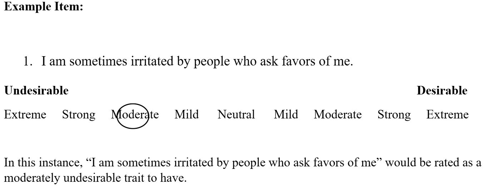

---
# Survey File Content with Neutral Pre-Selection Removed

## Kunpractice1

## Edpractice1

## **Readily overcome setbacks.**

```{r}
# https://x.com/i/grok/share/1DcUBUJovlpHmIbykgnGC6uGO

sd_question(
  type  = 'matrix',
  id    = 'prac1_EH',
  label = "How desirable is it to be **Extremely High** in this characteristic? (**top 1%**)",
  row="",
  option = c(
    'Very Undesirable'    = '1',
    'Undesirable'       = '2',
    'Neutral'           = '3',
    'Desirable'         = '4',
    'Very Desirable'    = '5'
  ))

```

When ready for the next rating, please hit `Next`:

```{r}
sd_next()
```

:::

::: {#kunpractice1a .sd-page}

## **Readily overcome setbacks.**

```{r}
sd_question(
  type  = 'matrix',
  id    = 'prac1_AA',
  label = "How desirable is it to be **Above Average** in this characteristic? (**top 30%**)",
  row="",
  option = c(
    'Very Undesirable'    = '1',
    'Undesirable'       = '2',
    'Neutral'           = '3',
    'Desirable'         = '4',
    'Very Desirable'    = '5'
  ))


```

When ready for the next rating, please hit `Next`:

```{r}
sd_next()
```
:::

::: {#kunpractice1b .sd-page}

## **Readily overcome setbacks.**

```{r}
sd_question(
  type  = 'matrix',
  id    = 'prac1_A',
  label = "How desirable is it to be **Average** in this characteristic?",
  row="",
  option = c(
    'Very Undesirable'    = '1',
    'Undesirable'       = '2',
    'Neutral'           = '3',
    'Desirable'         = '4',
    'Very Desirable'    = '5'
  ))


```

When ready for the next rating, please hit `Next`:

```{r}
sd_next()
```

:::

::: {#kunpractice1c .sd-page}

## **Readily overcome setbacks.**

```{r}
sd_question(
  type  = 'matrix',
  id    = 'prac1_BA',
  label = "How desirable is it to be **Below Average** in this characteristic? (**bottom 30%**)",
  row="",
  option = c(
    'Very Undesirable'    = '1',
    'Undesirable'       = '2',
    'Neutral'           = '3',
    'Desirable'         = '4',
    'Very Desirable'    = '5'
  ))


```

When ready for the next rating, please hit `Next`:

```{r}
sd_next()
```

:::

::: {#kunpractice1d .sd-page}

## **Readily overcome setbacks.**

```{r}
sd_question(
  type  = 'matrix',
  id    = 'prac1_EL',
  label = "How desirable is it to be **Extremely Low** in this characteristic? (**bottom 1%**)",
  row="",
  option = c(
    'Very Undesirable'    = '1',
    'Undesirable'       = '2',
    'Neutral'           = '3',
    'Desirable'         = '4',
    'Very Desirable'    = '5'
  ))


```

When ready for the next rating, please hit `Next`:

```{r}
sd_next()
```

::: 

::: {#kunpractice2item .sd-page}

The SECOND PRACTICE item that you will be asked to provide ratings for is:  

## **Easily awakened by noise**

When ready, please hit the `Next` button and you will begin the next sequence of ratings. 

```{r}
sd_next()
```

:::

::: {#kunpractice2 .sd-page}

## **Easily awakened by noise**

```{r}
sd_question(
  type  = 'matrix',
  id    = 'prac1_EH',
  label = "How desirable is it to be **Extremely High** in this characteristic? (**top 1%**)",
  row="", option = c(
    'Very Undesirable'    = '1',
    'Undesirable'       = '2',
    'Neutral'           = '3',
    'Desirable'         = '4',
    'Very Desirable'    = '5'
  ))

```

When ready for the next rating, please hit `Next`:

```{r}
sd_next()
```

::: 

::: {#kunpractice2a .sd-page}

## **Easily awakened by noise**

```{r}
sd_question(
  type  = 'matrix',
  id    = 'prac1_AA',
  label = "How desirable is it to be **Above Average** in this characteristic? (**top 30%**)",
  row="", option = c(
    'Very Undesirable'    = '1',
    'Undesirable'       = '2',
    'Neutral'           = '3',
    'Desirable'         = '4',
    'Very Desirable'    = '5'
  ))

```

When ready for the next rating, please hit `Next`:

```{r}
sd_next()
```

:::

::: {#kunpractice2b .sd-page}

## **Easily awakened by noise**

```{r}
sd_question(
  type  = 'matrix',
  id    = 'prac1_A',
  label = "How desirable is it to be **Average** in this characteristic?",
  row="", option = c(
    'Very Undesirable'    = '1',
    'Undesirable'       = '2',
    'Neutral'           = '3',
    'Desirable'         = '4',
    'Very Desirable'    = '5'
  ))


```

When ready for the next rating, please hit `Next`:

```{r}
sd_next()
```

:::

::: {#kunpractice2c .sd-page}

## **Easily awakened by noise**

```{r}
sd_question(
  type  = 'matrix',
  id    = 'prac1_BA',
  label = "How desirable is it to be **Below Average** in this characteristic? (**bottom 30%**)",
  row="", option = c(
    'Very Undesirable'    = '1',
    'Undesirable'       = '2',
    'Neutral'           = '3',
    'Desirable'         = '4',
    'Very Desirable'    = '5'
  ))


```

When ready for the next rating, please hit `Next`:

```{r}
sd_next()
```

:::

::: {#kunpractice2d .sd-page}

## **Easily awakened by noise**

```{r}
sd_question(
  type  = 'matrix',
  id    = 'prac1_EL',
  label = "How desirable is it to be **Extremely Low** in this characteristic? (**bottom 1%**)",
  row="", option = c(
    'Very Undesirable'    = '1',
    'Undesirable'       = '2',
    'Neutral'           = '3',
    'Desirable'         = '4',
    'Very Desirable'    = '5'
  ))


```

After completing the rating, please hit `Next`:

```{r}
sd_next()
```

:::


::: {#kunpracticeend .sd-page}

{fig-align="center" width="60%"}

So, that's the procedure. 

If you have any questions please ask the experimenter now, otherwise if you feel that you understand how to make accurate ratings, please hit the `Next` button and you will provide desirability ratings for 15 statements. 

```{r}
sd_next()
```

:::


::: {#PositiveLinear1 .sd-page}

```{r}
library(dplyr)
PSitem1 <- subset(slice_sample(PosLinear,n=1), select = "Text")
PosLinear <- PosLinear %>% filter(Text != PSitem1$Text)
```

The item that you will be asked to provide ratings for is: 

## **`r PSitem1$Text`**

When ready for the next rating, please hit `Next`:

```{r}
sd_next()
```

:::

::: {#PositiveLinear1a .sd-page}

## **`r PSitem1$Text`**

```{r}
## cat(paste(PSitem1$Text))

sd_question(
  type  = 'matrix',
  id    = 'poslinear_1EH',
  label = "How desirable is it to be **Extremely High** in this characteristic? (**top 1%**)",
  row="", option = c(
    'Very Undesirable'    = '1',
    'Undesirable'       = '2',
    'Neutral'           = '3',
    'Desirable'         = '4',
    'Very Desirable'    = '5'
  ))

```

When ready for the next rating, please hit `Next`:

```{r}
sd_next()
```

:::

::: {#PositiveLinear1b .sd-page}

## **`r PSitem1$Text`**

```{r}
## cat(paste(PSitem1$Text))

sd_question(
  type  = 'matrix',
  id    = 'poslinear_1AA',
  label = "How desirable is it to be **Above Average** in this characteristic? (**top 30%**)",
  row="", option = c(
    'Very Undesirable'    = '1',
    'Undesirable'       = '2',
    'Neutral'           = '3',
    'Desirable'         = '4',
    'Very Desirable'    = '5'
  ))

```

When ready for the next rating, please hit `Next`:

```{r}
sd_next()
```

:::

::: {#PositiveLinear1c .sd-page}

## **`r PSitem1$Text`**

```{r}
## cat(paste(PSitem1$Text))

sd_question(
  type  = 'matrix',
  id    = 'poslinear_1A',
  label = "How desirable is it to be **Average** in this characteristic?",
  row="", option = c(
    'Very Undesirable'    = '1',
    'Undesirable'       = '2',
    'Neutral'           = '3',
    'Desirable'         = '4',
    'Very Desirable'    = '5'
  ))

```

When ready for the next rating, please hit `Next`:

```{r}
sd_next()
```

:::

::: {#PositiveLinear1d .sd-page}

## **`r PSitem1$Text`**

```{r}
## cat(paste(PSitem1$Text))

sd_question(
  type  = 'matrix',
  id    = 'poslinear_1BA',
  label = "How desirable is it to be **Below Average** in this characteristic? (**bottom 30%**)",
  row="", option = c(
    'Very Undesirable'    = '1',
    'Undesirable'       = '2',
    'Neutral'           = '3',
    'Desirable'         = '4',
    'Very Desirable'    = '5'
  ))

```

When ready for the next rating, please hit `Next`:

```{r}
sd_next()
```

:::

::: {#PositiveLinear1e .sd-page}

## **`r PSitem1$Text`**

```{r}
## cat(paste(PSitem1$Text))

sd_question(
  type  = 'matrix',
  id    = 'poslinear_1EL',
  label = "How desirable is it to be **Extremely Low** in this characteristic? (**bottom 1%**)",
  row="", option = c(
    'Very Undesirable'    = '1',
    'Undesirable'       = '2',
    'Neutral'           = '3',
    'Desirable'         = '4',
    'Very Desirable'    = '5'
  ))

```

When ready for the next rating, please hit `Next`:

```{r}
sd_next()
```

:::


::: {#interlude .sd-page}

{fig-align="center" width="60%"}

Thank you for your responses! 

This completes the first rating procedure -- next we would like you to rate the same 15 items using a different rating procedure. 

Please notify the experimenter (across the room from you -- 478B) that you are ready for the next portion of the experiment!

```{r}
sd_next()
```

:::


::: {#edwards .sd-page}

For this half of the survey, we want you to rate **how desirable** is it to be for someone to be, in our United States culture, across a number of different characteristics.

Below we provide some examples of how we would like you to think and respond to “how desirable” it would be for a person to be characterized by different statements. 

---

Rate each personality characteristic on how desirable it is in others. 
You may want to think about the behavior of people who have this trait and then rate the desirability.



```{r}
sd_next()
```

:::

::: {#edpractice .sd-page}

The task we're asking you to do is unfamiliar to most people. Therefore, before we begin with the **actual** experiment, you will have the chance to *practice* with two items -- you also have the opportunity on these 2 items to ask the experimenter questions if you have them. 

<br>
<br>

The FIRST PRACTICE item that you will be asked to provide ratings for is: 

## **Readily overcome setbacks.**

Please hit the `Next` button when you are ready to begin the practice session.

```{r}

sd_next()

```

::: 

::: {#edpractice1 .sd-page}


## **Readily overcome setbacks.**

How desirable is this characteristic?


```{r}
# https://x.com/i/grok/share/1DcUBUJovlpHmIbykgnGC6uGO

sd_question(
  type  = 'matrix',
  id    = 'edprac1_EH',
  label = " ",
  row="",
  option = c(
    'Extreme'    = '1',
    'Strong'     = '2',
    'Moderate'   = '3',
    'Mild'       = '4',
    'Neutral'                  = '5',
    'Mildly'         = '6',
    'Moderately'     = '7',
    'Strongly'       = '8',
    'Extremely'      = '9'
  ))

```

When ready for the next rating, please hit `Next`:

```{r}
sd_next()
```

:::

::: {#edpractice2item .sd-page}

The SECOND PRACTICE item that you will be asked to provide ratings for is: 

## **Easily awakened by noise**

Please hit the `Next` button when you are ready to begin the rating.

```{r}

sd_next()

```

::: 

::: {#edpractice2 .sd-page}

## **Easily awakened by noise**

How desirable is this characteristic?


```{r}
# https://x.com/i/grok/share/1DcUBUJovlpHmIbykgnGC6uGO

sd_question(
  type  = 'matrix',
  id    = 'edprac2_EH',
  label = " ",#  label = "How desirable is this characteristic?",
  row="",
  option = c(
    'Extreme'    = '1',
    'Strong'     = '2',
    'Moderate'   = '3',
    'Mild'       = '4',
    'Neutral'                  = '5',
    'Mildly'         = '6',
    'Moderately'     = '7',
    'Strongly'       = '8',
    'Extremely'      = '9'
  ))

```

When ready for the next rating, please hit `Next`:

```{r}
sd_next()
```

:::


::: {#edpracticeend .sd-page}

{fig-align="center" width="60%"}

So, that's the procedure. 

If you have any questions please ask the experimenter now, otherwise if you feel that you understand how to make accurate ratings, please hit the `Next` button and you will provide desirability ratings for 15 statements. 

```{r}
sd_next()
```

:::

::: {#edPositiveLinear1 .sd-page}

The item that you will be asked to provide ratings for is: 

## **`r PSitem1$Text`**

When ready for the next rating, please hit `Next`:

```{r}
sd_next()
```

:::

::: {#end .sd-page}

## Thank you!!

{fig-align="center" width="60%"}

All of your responses have been recorded -- you can retrieve the experimenter and close this window now.

```{r}
sd_close("Exit Survey")
```

:::
